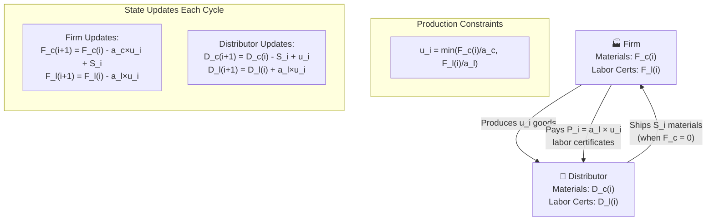

# Firm–Distributor Recurrence System (Labor-Time Certificates)

This document specifies a discrete-time model linking **Firms** and **Distributors**.
We currently **ignore fixed capital `f`** and track:

- `c` = raw materials inventory
- `l` = labor-time certificates

Time is indexed by cycles $i=0,1,2,\dots$.

---

## Notation

- Firm state: $(F_c(i), F_l(i))$
- Distributor state: $(D_c(i), D_l(i))$
- Indicator function:
  $$
  \mathbf{1}[\text{statement}] =
  \begin{cases}
  1, & \text{if the statement is true}\\
  0, & \text{otherwise}
  \end{cases}
  $$

- **The proportions for making materials**:
  - $a_c>0$: materials units required per unit of output
  - $a_l>0$: labor-hours (certificates) required per unit of output

- **Shipment policy parameter**:
  - $b>0$: target shipment size when the firm restocks (see below)

---

## Production this cycle

Output (goods produced) in cycle $i$ is limited by whichever input is scarce:

$$
u_i = \min\left(\frac{F_c(i)}{a_c}, \frac{F_l(i)}{a_l}\right)
$$

- **Materials consumed**: $M_i = a_c \cdot u_i$
- **Labor consumed**: $L_i = a_l \cdot u_i$

These definitions guarantee $0 \le M_i \le F_c(i)$ and $0 \le L_i \le F_l(i)$
(so we never go negative).

---

## Exchange Between Firm and Distributor

- The **firm restocks materials only when empty**:
  $$
  S_i = \min\{b, D_c(i)\} \cdot \mathbf{1}[F_c(i)=0]
  $$
  where $S_i$ is the shipment from Distributor $\to$ Firm this cycle.

- **Payment in labor certificates (value of goods produced)**:  
  Each good embodies $a_l$ labor-hours. Producing $u_i$ goods requires $a_l \cdot u_i$ hours.  
  Therefore:
  $$
  P_i = a_l \cdot u_i
  $$

> **Why this should work:** With a fixed recipe, each unit of output embodies $a_l$ labor-hours. Producing $u_i$ units uses $a_l \cdot u_i$ hours, so the firm transfers exactly that amount of labor-time certificates to the distributor.

---

## Recurrence relations

### Firm

**Materials balance:**
$$F_c(i+1) = F_c(i) - a_c \cdot u_i + S_i$$

**Labor certificates balance:**
$$F_l(i+1) = F_l(i) - a_l \cdot u_i$$

### Distributor

**Materials balance:**
$$D_c(i+1) = D_c(i) - S_i + u_i$$

**Labor certificates balance:**
$$D_l(i+1) = D_l(i) + P_i = D_l(i) + a_l \cdot u_i$$

All conditionals are encoded with indicators in $S_i$; no piecewise blocks needed.

---

## Optional variants

- **Ship "everything" on restock**: set $b=\infty$ to get
  $$
  S_i = D_c(i) \cdot \mathbf{1}[F_c(i)=0]
  $$
- **Price materials on restock (pre-payment)**:
  If you want labor to transfer **when** materials are shipped instead of when output is produced,
  replace $P_i=a_l \cdot u_i$ with
  $$
  P_i = p_c \cdot S_i
  $$
  where $p_c$ is the labor-per-material price. The system still stays well-posed.

---

## Example initialization

$$
F_c(0)=0, \quad F_l(0)=100, \qquad D_c(0)=100, \quad D_l(0)=100
$$
with $(a_c,a_l)=(1,1)$ and $b=50$.
Iterate the four recurrence relations each cycle.

---

## Flow Diagram

